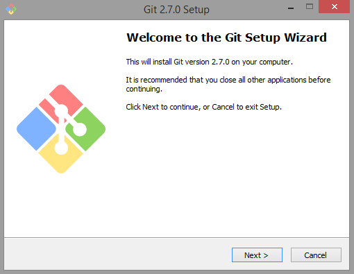
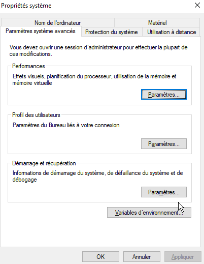
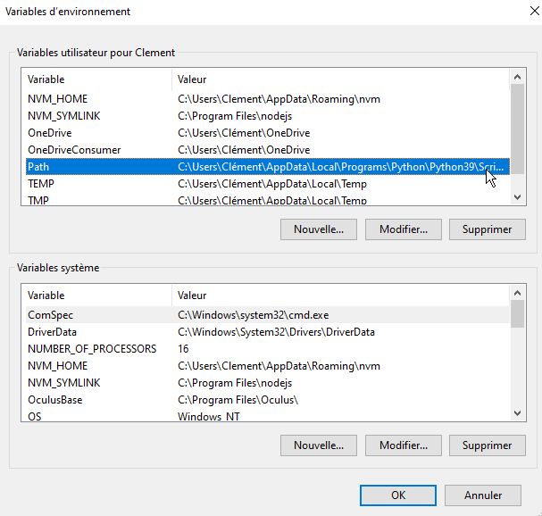
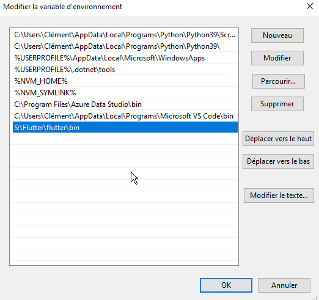
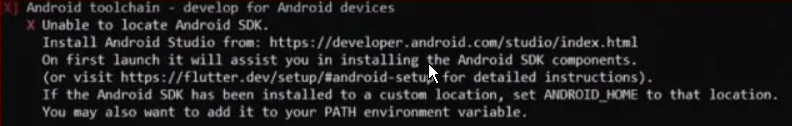
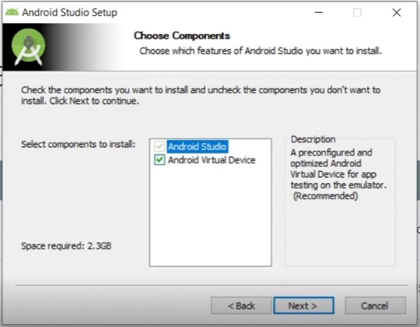

# Accueil
???+ warning "!! ATTENTION !!"

    ***Ne surtout pas suivre pour ce projet. Cette méthode est présenté pour vous si vous souhaitez redévelopper du flutter dans un autre projet.***

Nous passerons par un docker qui vous permetras de n'avoir rien à installer sur votre pc. Cela nous évitéra tous probleme de conflit entre les versions et permetras aussi un déploiement plus rapide.

## Application mobile

- [Getting Started](#getting-started) 
  **1** . [Installation de** GIT Bash ** ](#first) 
  **2** . [Téléchargement du SDK **Flutter** ](#second) 
  **3** . [Création de la variable d'environnement](#tree) 
  **4** . [Installation du SDK d’Android via Android Studio](#fourth) 
  **5** . [Acceptation des licences et ajout des plugins](#fifth) 

***

## Getting Started

Pour pouvoir commencer à développer dans les meilleures conditions, plusieurs installations sont nécessaires. Cette documentation est réalisée pour **Windows** uniquement. En ce qui concerne **Linux**, il vous faudra suivre des tutoriels en ligne.

***

### <a style="font-size: 24px;">**1**</a>. **Installation** de **Git Bash**

Vous pouvez taper git dans votre cmd pour vérifier la bonne installation.

***

### <a style="font-size: 24px;">**2**</a>. **Téléchargement** du [**SDK Flutter**](https://storage.googleapis.com/flutter_infra_release/releases/stable/windows/flutter_windows_2.8.1-stable.zip).

Extraire le fichier zip et placez le contenu dans l'emplacement d'installation souhaité pour le SDK.
???+ warning "Attention !"

    N'installez pas Flutter dans un répertoire tel que C:\Program Files\ qui nécessite des privilèges élevés.

Vous pouvez aussi le télécharger via la commande dans votre cmd: 
**git clone https://github.com/flutter/flutter.git -b stable**.
Le “-b stable” dans la commande peut se placer avant ou après.

### <a style="font-size: 24px;">**3**</a>. **Création** de la variable d'environnement

Tapez flutter dans l’invite de commande.

Si c’est la première fois que vous installez Flutter, vous aurez un message vous expliquant que flutter n'est pas recoonu en tant que commande interne...

Flutter n’est pas reconnu car il faut installer la variable d’environnement. Pour ce faire, tapez « environnement » dans la barre de recherche du menu Démarrer.  Cliquez sur « Modifier les variables d’environnement système ».

Cliquez sur le bouton **variables d’environnement** en bas à droite.

Vérifiez la précense de la variable **Path**.

Ensuite double-cliquez dessus pour ajoutez le lien vers le dossier « bin » de Flutter (vous trouverez ce dossier ou vous avez installer **Flutter**).

Fermer et rouvrir l’invite de commande puis taper “flutter”.
si vous n'avez plus l'erreur arretez le cmd. Nous n'avons pas besoin de cette commande pour le moment.
***

### <a style="font-size: 24px;">**4**</a>. **Installation** du **SDK d’Android** via **Android Studio**

Nous allons donc taper **flutter doctor** pour voir ce qu'il faut installer pour le bon fonctionnement de flutter.

Si vous obtennez cette erreur : 

il faut telecharger android studio via ce [**lien**](https://goo.gl/XxQghQ).

Pendant l’installation, cochez bien Android Virtual Device pour obtenir un émulateur.

Une fois l’installation terminé, lancez Android Studio.

Selectionner « Custom » et non « Standard » dans la fenêtre « Install Type ».

Une fois terminer il faut accepter les licences.

***

### <a style="font-size: 24px;">**5**</a>. **Acceptation** des **licences** et ajout des **plugins**

Pour accepter les licenses il vous faut taper la commande : 

**flutter doctor --android-licenses**

Il faut ensuite valider plusieurs fois en tapant **y** pour valider.

En relancant la commande flutter doctor il ne devrait n'y a voir que deux problèmes lié à Android Studio.

Il faut installer les deux plugins Flutter et Dart pour Android Studio.

???+ warning "Attention !"

    N'installez les deux plugins que si vous comptez coder sous Android Studio.

Lancez Android Studio. Une fois sur la page de bienvenue il faut allez dans **Configure** puis dans **Plugins**.

Ensuite dans la barre de recherche des plugins, entrez **Flutter** puis **Dart**.
Puis on redémarre Android Studio.

Télécharger **Visual Studio Code** si besoin puis lancez l’application et téléchargez les extensions **Flutter** et **Dart**. En téléchargeant l’extension Flutter, celle de Dart s’installe automatiquement.

Relancez une derniere fois la commande **flutter doctor**, normalement vous ne devriez plus avoir aucune erreur.

***
