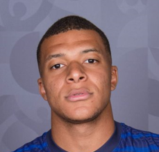
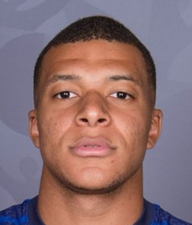

# Alignement du visage

## Définition

Le **face aligner** est un algorithme permettant **d'aligner les yeux sur une ligne complètement horizontale**. Cet algorithme intervient juste après la détection des différents points du visage. Il est nécessaire de passer par cette étape pour s'assurer d'un **résultat convenable**.

    

        

            
            <h3 style="margin:0 0 0 6px !important;">Mauvais MBAPPE</h3>
        

        
    

    

        

            
            <h3 style="margin:0 0 0 6px !important;">Bon MBAPPE</h3>
        

        
    

---

## Contexte

Le but est de pouvoir générer une **image originale tirée d'un visage d'un joueur de foot**. La problématique était de détecter un visage. Grâce à plusieurs packages externes : **OpenCV et MediaPipe**, il a été très facile de **récupérer plusieurs points** importants du **visage** afin de **tracer les contours**. Cependant, la question de l'**inclinaison de la tête** devait être prise en compte. En soit, une tête inclinée n'est **pas un problème** lorsque l'on génère un dessin du visage. Le dessin pourra toujours être réaligné par rapport à une ligne horizontale par la suite. Cependant, le machine learning sur la **direction du regard** sera fortement impactée si tous les visages ne sont **pas inclinés** de la **même façon**. Il aurait été beaucoup plus **compliqué** de faire du machine learning sur des **têtes inclinées**, les résultats auraient été des **faux positifs** ou **négatifs**.

## Aligner le visage

Pour pouvoir aligner un visage, il faut avoir des **points de références**, pour savoir si le visage est incliné. Le principe de l'algorithme est de reprendre les points des **deux yeux**. Pour chaque oeil, on reprend le **centre** entre ces deux points. Il y aura donc **deux centres pour chaque oeil**, pour un visage. Dernière étape, tracer une ligne entre ces **deux points centrales**. La ligne qui apparaîtra aura un **angle** par rapport à une ligne complètement horizontale. Le but ensuite est de **redresser l'image** pour que la barre soit **horizontale**.

    
    

???+ info "Informations complémentaires"
    Malheureusement, je pense qu'il n'est **pas nécessaire** de montrer l'algorithme, c'est un **calcul complexe mathématique** mélangeant manipulation de pixel et de distance. Si vous souhaitez comprendre l'algorithme, je vous conseille ce **[tutoriel](https://www.pyimagesearch.com/2017/05/22/face-alignment-with-opencv-and-python/)**.
