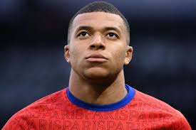
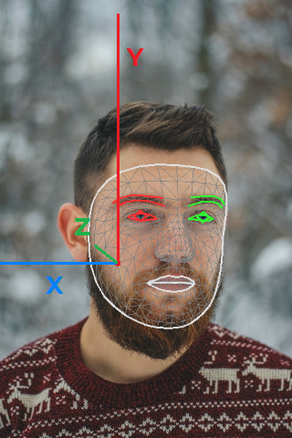
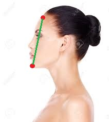
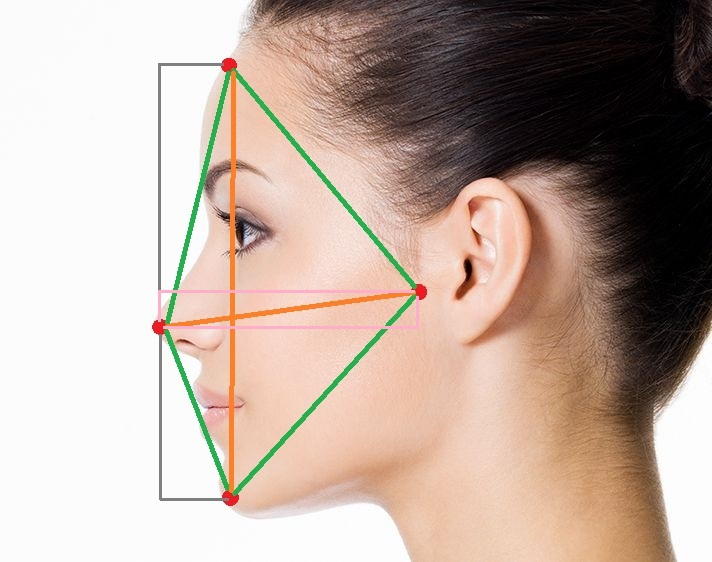
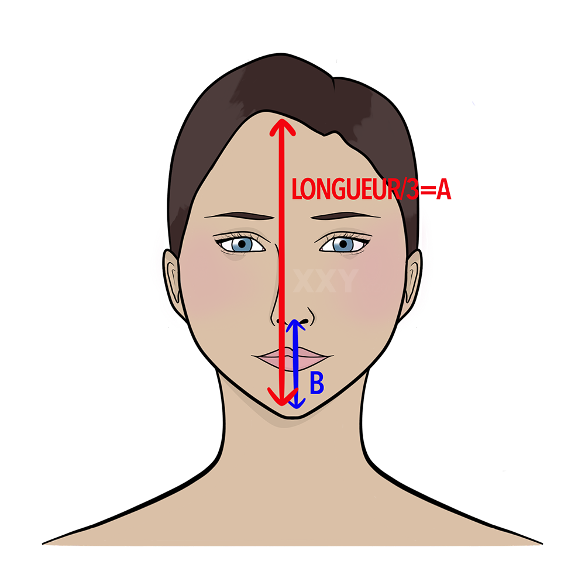

# Direction du regard

## Définition

Le **tilt learning** est un **algorithme de machine learning**. Il a été créé pour savoir si le **visage détecté** est orienté de la bonne façon. Un visage correctement orienté est un visage qui **regarde droit devant**.

---
<div style="display:flex;flex-direction:row;justify-content:space-around;margin-top:8px;margin-bottom:10px;">
    <div style="display:flex;flex-direction:column;">
        <div style="display:flex;flex-direction:row;align-items:center; justify-content:center;margin-bottom:4px;">
            
            <h3 style="margin:0 0 0 6px !important;">Mauvais MBAPPE</h3>
        </div>
        
    </div>
    <div style="display:flex; flex-direction: column;">
        <div style="display:flex;flex-direction:row;align-items:center; justify-content:center;margin-bottom:4px;">
            
            <h3 style="margin:0 0 0 6px !important;">Bon MBAPPE</h3>
        </div>
        
    </div>
</div>

---

## Contexte

Le but est de pouvoir générer une **image originale tirée d'un visage d'un joueur de foot**. La problématique était de détecter un visage. Grâce à plusieurs packages externes : **OpenCV et MediaPipe**, il a été très facile de **récupérer plusieurs points** importants du **visage** afin de **tracer les contours**. Cependant, la question de la **direction du regard** s'est vite posée. Il n'y a aucun **package externe** pour réaliser cette vérification de **façon optimale**. Il existe des solutions similaires, mais **uniquement** pour des **vidéos**. L'une des solutions les **moins coûteuses en termes de temps** que ce soit au niveau du **temps de veille**, du **temps de monté en compétence** et du **temps de mise en place** est le **machine learning**. Il existe d'autres notions efficaces : le **deep learning** et les **réseaux neuronaux**. Ces deux notions sont cependant bien **plus complexes** et ont une **précision similaire** comparée à un bon machine learning bien entrainé.

## Ce qu'il faut savoir sur le machine learning

Par définition, le machine learning est une **technologie d’intelligence artificielle** permettant aux ordinateurs d’apprendre **sans avoir été programmés** explicitement à cet effet. Pour apprendre et se développer, les ordinateurs ont toutefois **besoin de données à analyser** et sur lesquelles s’entraîner. La plupart du temps, le machine learning est pour réaliser une **prédiction**. En réalité, ces technologies d'intelligence artificielle sont des **algorithmes** (modèles) qui **interprètent plusieurs données** et les regroupent sous forme **logique**. Il est possible de représenter ce que fait le modèle de machine learning sous forme d'un **graphique**.

### Prenons l'exemple avec le modèle de type clustering :


On peut voir **plusieurs types d'algorithmes clustering** (colonne). Ce sont des algorithmes qui vont regrouper de manière **logique** différentes données afin d'en faire une **catégorie**. Ces données sont considérées comme des **données d'entrainement**. Chacune de ces données peut être identifiée afin de fournir une base à l'algorithme. Dans notre exemple, il n'est pas obligatoire de lui fournir une catégorisation. Le **clustering** peut regroupé de manière **mathématique** les données. Lorsque l'on testera une nouvelle donnée pour faire une prédiction, **l'algorithme analysera les données de la même manière que les données qui ont servi pour tester le modèle**. Il pourra par la suite dire que cette donnée correspond aux données de la **catégorie x.**

## Type de machine learning

Il existe beaucoup de **types de machine learning** qui eu même ont **plusieurs sous types**. Dans notre solution, nous utilisons le **package scikit-learn** qui permet de facilité l'utilisation de ces modèles. Scikit-learn fourni une **très bonne documentation** pour connaître tous les paramètres de chaque modèle et leur fonctionnement.
Chaque modèle est **optimisé** pour des **types de données**, **quantité de données** et l'objectif de la prédiction. Voici un **schéma** pour savoir quel modèle sera le plus adapté à ce que l'on souhaite faire :


## Nos modèles

Dans notre solution, si on suit le schéma au-dessus, nous avons plus de **50 données** de test (différentes images de plusieurs visages regardant dans des directions différentes).<br><br>
Nous souhaitons prédire **une catégorie**. Nos catégories ici seront les différentes directions : **haut, bas, gauche, droit, en face**. Le fait de vouloir prédire une catégorie signifie que les modèles de type **regression et dimensionality reduction** ne seront pas très utiles.<br><br>
Par la suite, le schéma nous demande s'il y a la **présence de texte** : **oui (haut, bas ...)**. Les modèles **clustering** ne sont donc pas conseillés.<br><br>
Ensuite, nous rentrons enfin dans un type de machine learning : **classification**. La première information importante est de connaître le **nombre de données de test**. Malheureusement, réunir plus de **100 000 données** quand il s'agit d'image est une mission quasiment impossible, sachant qu'il faut toutes les identifier en termes de direction.

    ???+ info "Augmentation d'image"
        Cependant, il est possible de faire de **l'augmentation d'image**, c'est-à-dire **multiplier** le nombre d'images avec **celle que l'on a déjà**. Par exemple, retourner l'image horizontalement. Ce qui multipliera par deux le nombre d'images.
        <div style="display:flex;flex-direction:row;justify-content:center;margin-bottom:10px;">
            
            
        </div>

Nous croisons un **premier modèle** : **LinearSVC**. Nous pourrions nous arrêter ici et tester ce modèle avec nos données. Mais pour que notre **prédiction** soit **la plus précise** possible, nous pouvons sélectionner **plusieurs modèles**. Nous allons donc sélectionner les modèles suivant: **Naive Bayes, KNeighbors classifier, SVC et Ensemble classifiers**. À savoir qu'il existe **plusieurs types de modèle** pour le Naive Bayes, pour le KNeighbors classifier et pour les Ensemble classifiers.<br><br>
Le plus efficace pour prédire correctement est d'avoir un **nombre impair** de modèles pour récupérer à chaque fois la **prédiction la plus présente**. Si jamais le nombre est pair est qu'une égalité survient, il sera difficile d'identifié la prédiction a privilégier.

## Liste des packages à installer

- **[numpy](https://numpy.org/)**
- **[imutils](https://github.com/PyImageSearch/imutils)**
- **[dlib](http://dlib.net/)**
- **[mediapipe](https://google.github.io/mediapipe/getting_started/python.html)**
- **[pandas](https://pandas.pydata.org/)**
- **[scikit-learn](https://scikit-learn.org/stable/)**
- **[opencv-python](https://opencv.org/)**
- **[scikit-image](https://scikit-image.org/)**
- **[joblib](https://joblib.readthedocs.io/en/latest/)**

## **Première étape** - formatage et preprocessing des données
Pour pouvoir réaliser un machine learning efficace, outre le nombre d'image, il faut des données **cohérentes** et **nettoyer**. A ce stade, nous avons déjà récupéré les landmarks (zone du visage). [Voir la documentation](./face_landmarks.md) sur la détection de la zone du visage pour comprendre quelles sont les données récupérées. Nous avons donc **486 points** du visage avec un **x** correspondant à la position en **largeur**, un **y** correspondant à la position en **hauteur** et enfin un **z** correspondant à la profondeur.

<div style="display:flex;justify-content:center;margin-bottom:10px;height:300px;">
    
</div>

Dans la documentation, j'explique que le **z** est calculé par rapport à une **feuille à plat**. Tout ce qui est **avant** (plus près de la caméra) sera **positif**, tout ce qui est **après** (plus loin dans la photo) sera **négatif**. Cependant, ces valeurs sont toutes **différentes selon la photo, selon le visage et surtout selon l'échelle qui n'est jamais la même**. Cette notion d'échelle est très importante pour le machine learning. Il sera beaucoup moins efficace si ces données ne sont pas sur la même plage de données.

À ce stade nous avons donc **486 points * 3** (x, y et z). Si nous donnons les coordonnées de tous ces points en données, il y a de fortes chances qu'ils ne **trouvent jamais si la photo est correcte**. Les **visages sont tous différents**, des personnes ont des mentons moins profonds que le front, d'autres ont un nez plus imposant, ... Il faut donc récupérer **uniquement les informations qui nous permettront d'avoir des informations performantes et pertinentes**.

### Direction horizontale

Il existe **plusieurs façons**, avec les points que l'on a, pour déterminer si le visage regarde à **gauche** ou à **droite**. Pour que le machine learning soit **efficace**, nous allons récupérer **deux données** qui à elle seule pourraient déterminer si le visage regarde dans une direction. Cependant, si l'on augmente le nombre de données, le machine learning sera bien plus **précis**. Avant de commencer, toutes ses données partent du principe que chaque visage a une **différence de symétrie négligeable**. Nous avons tous plus ou moins un visage symétrique. Et la cible que nous souhaitons "cartoonisé" sont en général **très sportif** et **sans handicap majeur**.

???+ danger not-expand "Ribéry est notre ennemi"

<br>

**<a stlye="font-size: 20px;">Première méthode</a>**

La **profondeur de deux points** peut déterminer une direction. Dans notre cas, nous prenons le **point du visage le plus à gauche** et le **point du visage le plus à droite**. Et nous regardons la **différence** en pourcentage entre les deux profondeurs. Si la différence dépasse un certain seuil, **seuil qui sera géré par le machine learning**, le visage regardera à droite ou à gauche. Pour mieux comprendre, nous allons, prendre **l'axe Z** que nous allons utilisé **comme X** et l'axe des **Y**.

<div style="display:flex;justify-content:space-around;margin-bottom:10px;height:300px;">
    
    
</div>

Sur l'exemple, si on regarde le schéma, on voit que le point de gauche à sa profondeur Z (**x dans le schéma**) **plus proche de 0**, le **0** correspond ici à l'**objectif de la caméra** (ou l'écran), que le **point de droite légèrement plus éloigné de 0, plus profond**. Si vous mettez vos **doigts de chaque côté de votre visage** et que votre **écran d'ordinateur** correspond au **0**, vous verrez que si vous tournez la **tête à gauche**, votre **doigt à droite** de votre visage se **rapproche de l'écran** tandis que le point gauche s'en éloigne. Ces données pourront donc être ajoutées à notre **datasets** (jeu de données qui seront analysées par le machine learning).
<br><br>

**<a stlye="font-size: 20px;">Deuxième méthode</a>**

Cette méthode se base essentiellement sur la **symétrie du visage**. En toute logique, un visage qui regarde la caméra droit devant, aura des **proportions identiques** entre la partie **gauche du visage** et la partie **droite du visage**. Il suffit, pour vérifier, de prendre une distance entre deux points sur la partie gauche, et prendre leur **deux points symétriques du côté droit** du visage et calculer la **différence** entre les deux distances de chaque point.
<div style="display:flex;justify-content:center;margin-bottom:10px;height:300px;">
    
</div>

On remarque assez facilement que la **distance à gauche est plus grande** que la distance à droite. Ce phénomène s'explique par le fait que la **partie d'un visage** est **compressée** par rapport à **l'observateur**.

Nous avons deux valeurs plutôt précises qui assemblées, augmenterons la performance du machine learning à **détecter** si le visage **regarde trop à droite ou trop à gauche**.

### Direction verticale

Cette **partie a été la plus compliquée** à réaliser, mais elle s'avère la plus efficace. Pour identifier la direction **vers le haut ou vers le bas**, il y a plusieurs facteurs qui compliquent la lecture des données. Les **visages** sont tous **différents** en ce qui concerne la profondeur de leur visage.

Logiquement, on **pourrait se dire** : c'est plutôt simple, on prend la **profondeur du point le plus haut** et **du plus bas du visage** et on regarde la différence. Voilà pourquoi il n'est pas possible de faire cela :

<div style="display:flex;justify-content:space-around;margin-bottom:10px;height:300px;">
    
    
</div>

Ici, comme pour la **première méthode horizontale**, on met la **profondeur sur X** en gardant Y. Cela nous permet d'avoir le **profil de la photo**.
On voit clairement que pour la première, il n'y aurait pas de problème, cependant la seconde, on remarque que son menton est **toujours plus avancé que son front**. Si on devait ajouter ces données dans un machine learning, je suis sûr que la prédiction serait souvent **fausse** car ses données ressembleraient trop aux données d'une personne qui regarde **légèrement vers le haut**. Cela fonctionne aussi dans le sens inverse (le bas), même si c'est plus rare.

La première méthode consiste à **rajouter deux points de références** au niveau du **nez** et du côté de **l'oreille**. Ces points de références nous permettront de réaliser **plusieurs calculs** pour en retirer des **informations**. Bien sûr la méthode sera multipliée par deux, côté **gauche** et côté **droit**.

<div style="display:flex;justify-content:center;margin-bottom:20px;height:300px;">
    
    
</div>
<div style="display:flex;justify-content:center;margin-bottom:20px;height:300px;">
    
</div>

<br><br>

**<a stlye="font-size: 20px;">Première méthode</a>**

Ce sont les lignes **grises et roses** (zoomer pour les voir) qui vont nous intéresser dans un premier temps. Nous allons reprendre la différence entre les **deux lignes grises** en bas et en haut qui correspondent à la distance entre le **front et le nez et le menton et le nez**. Puis reprendre la **hauteur entre le nez et le point à côté de l'oreille** (les lignes roses). Avec ces deux données, le machine learning pourra déjà prédire correctement **plus de la moitié des cas**.

Il faut savoir que cette méthode réduit légèrement le **facteur de la morphologie du visage**, mais elle ne pourra pas fonctionner seule, il faut obligatoirement **la deuxième méthode** pour que le machine learning puisse **identifier un pattern** dans ces données.
<br><br>

**<a stlye="font-size: 20px;">Deuxième méthode</a>**

Pour que la première méthode fonctionne, il faut une **valeur verticale de référence**. Il y a beaucoup d'études plus ou moins scientifique qui ont été faites sur la morphologie et sur les **différentes règles de mensuration** d'un visage. Celle qui nous intéresse ici est la mensuration entre **le menton et le nez** et **le nez et le haut front**. Pour mieux comprendre, voici une image :

<div style="display:flex;justify-content:center;margin-bottom:20px;height:250px;">
    
</div>

La plupart du temps, cette proportion est respectée, il y a bien entendu un **pourcentage de précision** pour ne pas exclure les **cas extrêmes**, mais encore une fois, c'est au rôle du machine learning d'effectuer ces vérifications.

Dans notre datasets, il n'y aura plus cas rajouter les informations de la **première méthode** et les **distances de la deuxième méthode**.

Pour les deux méthodes, comme nous le faisons à droite et à gauche, nous reprenons à chaque fois la **moyenne entre toutes les valeurs**.

### Rappels / conclusions

Il y a **5 données**, **2 horizontales** et **3 verticales**. Elles correspondent à notre datasets. C'est ces données que l'on donnera au modèle du machine learning. En plus, il nous faudra une dernière donnée, l'une des plus importantes pour entraîné notre machine learning : la **direction du visage**. Comme on sait où se situe nos images de test et à quoi elles correspondent, on aura plus qu'à rajouter : **"up", "down", "left", "right", "front"**.

## Deuxième étape : tester un modèle

Comme dit précédemment, le package **scikit-learn** fourni les modèles, il suffit simplement d'importer les modèles souhaités. Sur ce **[site](https://scikit-learn.org/stable/modules/classes.html#module-sklearn.neural_network)**, vous trouvez tous les types de modèles. Ceux qui nous intéressent finissent la plupart du temps par le mot **Classifier**.

Pour cette documentation, on testera le modèle **RandomForestClassifier**. Avant tout, il est important de comprendre comment il fonctionne. **Random forest** signifie **forêt aléatoire**, il est basé sur les **arbres de décisions**.

<div style="display:flex;justify-content:center;margin-bottom:10px;">
    
</div>

L'arbre de décision, **à chaque valeur d'une première donnée**, la divise en **plusieurs possibilités**. Il va choisir ensuite celle qui **correspond la mieux**, puis va proposer **toutes les possibilités d'une deuxième donnée**, etc.
Le principe de la random forest est de **multiplier aléatoirement** les arbres de décisions. Chaque arbre **appréhendera les données de façon différentes**. À la fin, la donnée à prédire aura **traversée chaque arbre**, les résultats seront **assemblés** afin de proposer une **prédiction finale**.

### Code

Pour pouvoir commencer à **créer** notre modèle et **l'entraîner**, il faut des données. Dans notre solution, les données qui ont servi à entraîner le modèle se trouvaient dans les dossiers *app/generation_nft/librairies/tilt_learning/tests/...*. Dans le dossier se trouvait **5 dossiers** correspondant aux différentes directions des visages. Grâce à la **première étape**, nous avons un fichier **JSON** comportant toutes les informations nécessaires. Il n'y a plus qu'a importé les données dans une variable appelée **datasets**.

```python
from pandas import read_json

data_frame = read_json(self.tilt_datasets_path)
```

data_frame est du type **DataFrame** de la libraire pandas. Cette classe est analysable par tous les modèles de machine learning fourni par **scikit-learn**.

Ensuite, il faut **diviser ces données en deux**, les données de **d'entraînement** et les données de **test**. Les données d'entraînement serviront à, comme son nom l'indique, **entraîner le modèle**. On fournira au modèle ces données avec la **direction du visage** pour chaque donnée. Pour les données de test, on essayera de les prédire et de faire correspondre la direction prédite avec la réelle direction, c'est ce qui nous donnera un **pourcentage de précision du modèle**.
Pour effectuer cette séparation, il faut utiliser la fonction **train_test_split**. Elle accepte un paramètre **test_size** qui correspond à un **pourcentage de division**. 0.2 signifie que **20%** des données seront des données de test et **80%** seront celles qui entraîneront le modèle.

```python
from sklearn.model_selection import train_test_split

trainset, testset = train_test_split(data_frame, test_size=0.2, random_state=0)
```

Pour pouvoir insérer les données correctement dans le modèle, il faut les **"preprocess"**, les traiter. C'est-à-dire **encoder** puis **isoler** la donnée cible de prédiction. De notre côté, c'est la direction du visage, la **dernière colonne dans le DataFrame**.
```json
{
	"horizontal_distance_difference": 96,
	"horizontal_z_difference": 92,
	"vertical_distance_difference": 91,
	"percentage_distance_middlepoint_difference": 64,
	"class": "front"
}
```

Pour l'encodage, nous allons convertir les **valeurs textes en chiffres** :
```py
code = {"up": 1, "down": 1, "left": 1, "right": 1, "front": 2}
for column in data_frame.select_dtypes("object"):
    data_frame[column] = data_frame[column].map(code)
```

Toutes les directions sauf "front" auront la valeur 1. Pour faire la modification, on **parcourt les colonnes textes** (**object**) du DataFrame et on effectue un **mapping des valeurs**.

Pour l'isolation de la donnée cible, il nous suffit de **slice** le DataFrame, comme s'il s'agissait d'une liste ou un tableau.
```py
target_column = "class"
x = data_frame.drop(target_column, axis=1)
y = data_frame[target_column]
```

Passons à l'étape tant attendue, **l'ajout des données** dans le modèle.
Il faut tout d'abord, **importer le modèle**. Nous allons aussi importer en plus différentes fonctions qui permettrons de **mettre une valeur sur la précision de la prédiction**. Ensuite, il ne nous reste plus qu'à entraîner notre modèle, puis de prédire les données de test.

```python
from sklearn.ensemble import RandomForestClassifier
from sklearn.metrics import accuracy_score

x_train, y_train = self.preprocessing(trainset) # FONCTION QUI ENCODE ET ISOLE
x_test, y_test = self.preprocessing(testset) # FONCTION QUI ENCODE ET ISOLE

model = RandomForestClassifier()
model.fit(x_train, y_train)
y_pred = model.predict(x_test)

print(accuracy_score(y_test, y_pred))
```

Et voilà, le modèle du machine learning a été **créé et entraîné**. Bien entendu, il y a plusieurs **paramètrages** pour **améliorer la précision** pour chaque modèle. Pour savoir quels sont les paramètres les plus optimaux afin d'améliorer la précision, il faut utiliser **GridSearchCV**. Il n'y aura pas plus d'information concernant cette méthode dans cette documentation, mais je vous conseille d'allé regarder cette **[vidéo](https://www.youtube.com/watch?v=r58meM7ieaQ)**.


## Troisième étape : générer son model

Dernier point de cette documentation, **l'exportation du modèle**. En production, nous n'allons pas réentrainer le modèle et retester la prédiction. Nous souhaitons uniquement lui **fournir une donnée** et que **le modèle la prédise**.

Pour exporter le modèle, le package **joblib** nous permet de le faire très simplement.

```py
from joblib import dump as dump_model

dump_model(model, f"{self.model_path}_{name}_model.pkl") # URL OUTPUT
```

Dans le code, il suffira de **charger le modèle** avec la même librairie.

```py
from joblib import load as load_model
from sklearn.feature_extraction import DictVectorizer

model = load_model(f"{self.model_path}_{dict_model.get('name')}_model.pkl")
datasets_array = DictVectorizer().fit_transform(datasets).toarray() # CONVERTI LES DONNEES EN DATAFRAME
prediction = model.predict(datasets_array)[0] # CORRESPOND à 1 (pas front) ou 2 (front)
```

??? question not-expand "Si vous avez des questions, n'hésitez pas à les poser sur les supports adaptés."
